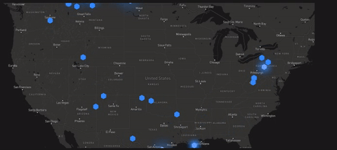

# Futuristic Map Marker

Beautiful custom map marker for [Leaflet](https://leafletjs.com/) mapping library, one of the most used and simple for web maps creation. Has the default map marker, the omnipresent icon , it's ok, but I need something more eye candy, more... futuristic!

## Demo

  

## How It Works

Leaflet library have the option to create custom markers. This is achieved putting a simple **HTML DIV** element instead the default image. I use this option and add some CSS to make this div transparent and add as content the [hexagon Unicode](https://www.compart.com/en/unicode/U+2B22) symbol. After I use transitions to add effects and colors and the result is here. See the screen GIF capture to get an idea of how this look.

## Usage

- clone this repo
- run `npm install`
- open `index.html` in browser
